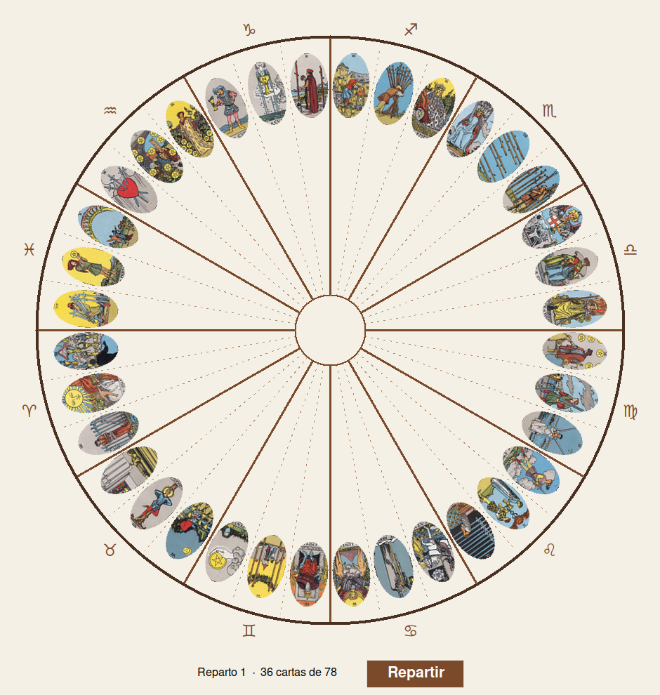

# AstroTarot — Rueda de 36 cartas

Aplicación en **Python 3** con **Tkinter** que reparte cartas de tarot sobre una
rueda circular dividida en secciones astrológicas.



## Descripción

La aplicación dibuja un círculo dividido en **12 secciones de 30°**, cada una
subdividida en **3 porciones de 10°** (36 porciones en total). Al pulsar el
botón **Repartir** se seleccionan **36 cartas de las 78** disponibles, sin
repetición, y se coloca una imagen en cada porción de 10°:

- 3 cartas por cada sección de 30°.
- Una imagen por cada porción de 10°.
- La sección 0° comienza a las **9 en punto** y avanza en **sentido
  antihorario** (de izquierda a derecha por arriba).
- Las cartas se muestran con su parte superior apuntando hacia el exterior de
  la rueda.
- El orden de las secciones es fijo; lo que cambia en cada reparto son las
  cartas.

Las divisiones gruesas marcan las secciones de 30° y las líneas punteadas
finas las porciones de 10°.

## Características

- Interfaz gráfica ligera con Tkinter.
- Reparto aleatorio **sin repetición** mediante `random.sample`.
- Cartas recortadas y rotadas con `Pillow` (sin rellenos ni fragmentos
  sobrantes alrededor de las imágenes).
- La ventana se **ajusta automáticamente a la resolución de la pantalla**;
  todos los elementos de la rueda se escalan de forma proporcional.
- Contador de repartos y total de cartas usado.

## Requisitos

- Python 3.8 o superior.
- Tkinter (incluido con Python en la mayoría de distribuciones).
- Pillow.

En Debian/Ubuntu, si faltan dependencias:

```bash
sudo apt install python3-tk
pip install -r requirements.txt
```

## Instalación

```bash
git clone https://github.com/TU_USUARIO/astrotarot.git
cd astrotarot
pip install -r requirements.txt
```

Las imágenes de las cartas deben estar en una carpeta llamada **`Cartas`**
(formato JPG) junto al script. Se buscan en este orden:

1. `Cartas` junto al script
2. `Cartas` en el directorio de trabajo
3. `astrotarot/Cartas` junto al script o en el directorio de trabajo

## Uso

```bash
python3 repartir_cartas.py
```

Una vez abierta la ventana, pulsa el botón **Repartir** para realizar un nuevo
reparto aleatorio de las 36 cartas.

> **Nota:** las 78 cartas incluidas en `Cartas/` corresponden a los arcanos
> mayores y menores del tarot de Rider-Waite.

## Estructura del proyecto

```
astrotarot/
├── repartir_cartas.py      # Aplicación principal
├── Cartas/                 # Las 78 cartas en formato JPG
├── docs/
│   └── previsualizacion.png
├── requirements.txt
└── README.md
```

## Cómo funciona

- **Geometría:** la rueda parte de la sección 0° en las 9 en punto y gira en
  sentido antihorario. Las divisiones se dibujan cada 10° (finas y punteadas)
  y cada 30° (gruesas).
- **Reparto:** `random.sample` elige 36 de las 78 cartas; cada carta se
  redimensiona, se recorta en forma de elipse (para que la rotación no deje
  esquinas rellenas) y se rota con Pillow según la inclinación de su porción.
- **Ajuste a pantalla:** el tamaño del lienzo se calcula a partir de
  `winfo_screenwidth/height` dejando márgenes para la barra de botones; el
  radio del círculo y el tamaño de las cartas se escalan proporcionalmente.

## Licencia

Este proyecto se distribuye bajo la licencia **MIT**. Consulta el archivo
[LICENSE](LICENSE) para más detalles.